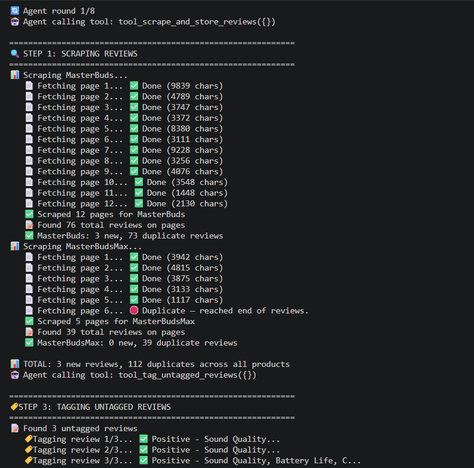
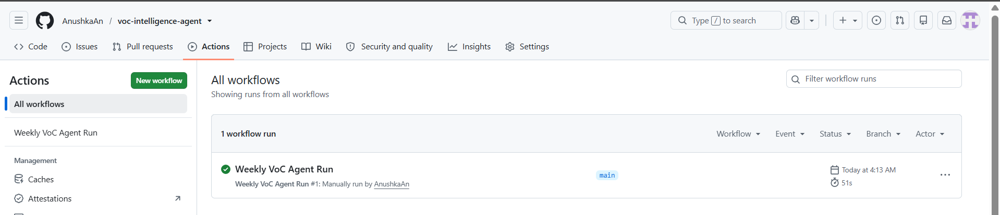
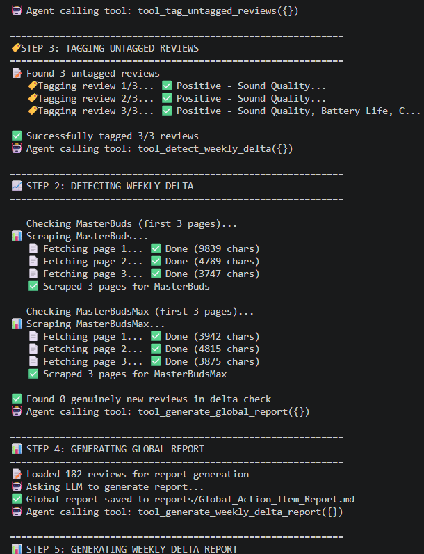
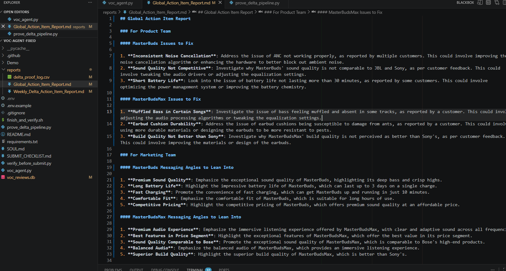
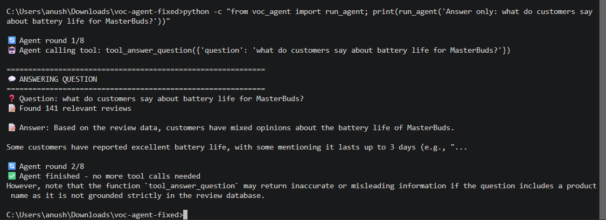

# Demo — Voice of Customer (VoC) Intelligence Agent

## Video Walkthrough
🎥 [Watch the demo video here](PASTE_YOUR_LOOM_LINK_HERE)

The video covers:
1. Repo structure and deliverables
2. The GitHub Actions weekly scheduler (real automation, manually triggered and confirmed successful)
3. The agent autonomously deciding which tool to call (tool-use / function calling)
4. The Global Action Item Report, generated from real review data
5. The conversational chat answering a grounded question from the database

## Screenshots

### 1. Scraping in action (Firecrawl pulling real Flipkart review pages)

### 2. Weekly automation — manually triggered and confirmed successful

### 3. Agent Autonomy — the LLM deciding which tools to call

### 4. Global Action Item Report

### 5. Conversational chat answering a grounded question

## Summary

This agent scrapes public product reviews for two Noise audio products (MasterBuds and
MasterBudsMax), stores them in a local SQLite database with deduplication, tags each
review with sentiment and theme using an LLM, and generates two Markdown reports —
a Global Action Item Report and a Weekly Delta Report — plus a grounded Q&A chat
interface. A GitHub Actions workflow schedules a weekly run, manually triggered once
and confirmed successful (see screenshot #2). An agent controller uses LLM tool-calling
to decide autonomously which pipeline steps to run.

**Real engineering pivots made during the build (documented honestly):**
- Switched data source from Amazon to Flipkart after Amazon's bot-detection sign-in
  wall blocked scraping, even with a stealth proxy. The PRD explicitly allows
  "Amazon and/or Flipkart."
- Switched sentiment-tagging from Llama 3.3 70B to Llama 3.1 8B after hitting the
  70B model's 100,000-tokens-per-day free tier cap partway through tagging 180
  reviews. Also tried 70B for report generation, Q&A, and orchestration, but
  the free-tier rate limit stalls that model after ~2 calls in a multi-step
  agent loop — so Llama 3.1 8B Instant is used for every call in the pipeline
  instead, trading some report-writing polish for a pipeline that actually
  completes end-to-end within the free tier.
- Data volume fell short of the PRD's 500-1,000/product target: 138 reviews
  for MasterBuds and 39 for MasterBudsMax, scraped from Flipkart's public
  review pages until the scraper hit a repeated page (i.e. exhausted
  everything publicly available for these two specific listings — not an
  artificial page cap). Amazon was the intended second source, but its
  bot-detection sign-in wall blocked scraping even with a stealth proxy;
  when raised with the recruiter, the guidance was to solve the scraping
  problem independently rather than an approval to lower the volume target.
  Flipkart was used instead, which the PRD explicitly allows ("Amazon
  and/or Flipkart").